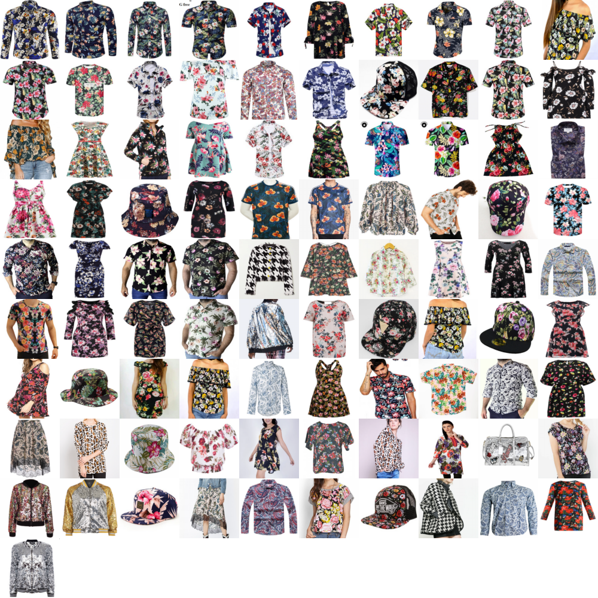

## Esse Projeto foi modificado o scrit principal, agora é possivel usar todo o dataset e validar usando KNN e validação cruzada

### Todos os creditos vão para https://github.com/jmsaavedrar

# Busca por Similaridade
Este projeto permite que você compute características e aplique busca por similaridade usando uma camada oculta de uma ResNet50.

## Dependências
Este projeto depende do projeto convnet2, que você pode baixar [aqui](https://github.com/jmsaavedrar/convnet2). Portanto, você precisará definir o caminho local do convnet2 no topo do arquivo [ssearch.py](ssearch.py).

## Computar Características de um Catálogo
Um catálogo é um conjunto de imagens usadas para consulta. Um catálogo é definido por um arquivo de texto listando todos os nomes de arquivos que você processará. Para este exemplo, você pode usar nosso catálogo contendo dois conjuntos de imagens, um contendo imagens distribuídas em 10 cores diferentes, e o outro com 10 texturas diferentes. O catálogo foi coletado por Andres Baloian, e pode ser baixado [aqui](https://www.dropbox.com/s/ri743kwqh8t6a7r/dataset_atributos.zip?dl=0).

Além disso, para facilitar a configuração, um arquivo de configuração é necessário. Este arquivo de configuração tem muitos parâmetros, mas você só precisa prestar atenção aos seguintes parâmetros:

* DATA_DIR: O diretório onde os dados são armazenados. Uma pasta chamada *ssearch* deve existir, pois ela conterá todos os dados produzidos pelo script.
* IMAGE_WIDTH:  Largura da imagem de entrada.
* IMAGE_HEIGHT: Altura da imagem de entrada.
* CHANNELS: Número de canais da entrada.

Você pode encontrar um exemplo deste arquivo de configuração em [resnet50.config](config/resnet50.config).

Por fim, o comando para computar o catálogo é:
```
python ssearch.py -config config/resnet50.config -name RESNET -mode compute
```
onde RESNET é o nome de uma seção no arquivo de configuração.

## Consultando
Para consultar você pode usar o seguinte comando:
```
python ssearch.py -config config/resnet50.config -name RESNET -mode search
```

Como você pode notar, apenas mudamos o parâmetro *mode* para *search*. Após executar o comando anterior, o sistema pedirá um nome de arquivo, que é a consulta de entrada.
```
Query: test_images/flower_1.jpg
```
Por exemplo, você pode usar as imagens de teste que vêm com este projeto. Então, o mecanismo de busca procurará por imagens similares e uma colagem com os resultados é gerada na pasta atual. Neste caso, o resultado é armazenado no arquivo flower_1.jpg_l2_result.png, onde a primeira imagem é a consulta.



